# Hybrid Cloud Identity — Microsoft Entra ID & Entra Connect Sync

> Extending the on-premises Active Directory lab into the cloud, connecting local Active Directory to Microsoft Entra ID using Entra Connect Sync.

---

## Table of Contents

- [Overview](#overview)
- [Cloud Tenant Setup](#cloud-tenant-setup)
- [Manual Cloud User & Group Testing](#manual-cloud-user--group-testing)
- [Preparing the Domain Controller for Cloud Connectivity](#preparing-the-domain-controller-for-cloud-connectivity)
- [Installing Microsoft Entra Connect](#installing-microsoft-entra-connect)
- [Configuring the Sync (Custom Install)](#configuring-the-sync-custom-install)
- [Result — Sync Confirmed Working](#result--sync-confirmed-working)
- [Troubleshooting Notes](#troubleshooting-notes)

---

## Overview

This phase extends the local Active Directory lab into a **hybrid identity environment** — connecting the on-premises Domain Controller to Microsoft Entra ID (Microsoft's cloud identity service), so local users and groups exist in both places at once.

This mirrors how most real organizations run today: not fully on-prem, not fully cloud, but a hybrid of both.

---

## Cloud Tenant Setup

1. Signed up for **Azure for Students** (no credit card required, verified using an active university email).
2. Created a dedicated Microsoft Entra ID tenant, separate from any existing organization's tenant.
3. Confirmed **Global Administrator** role on the new tenant.

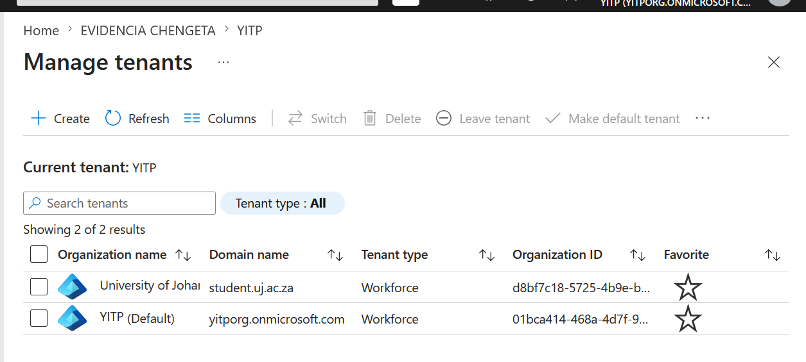

---

## Manual Cloud User & Group Testing

Before connecting the local AD, a manual test was done directly in the cloud tenant to understand the environment first — same principle used earlier in the on-prem lab (manual before automation).

1. Created a test user directly in Entra ID (cloud-only, no on-premises connection).
2. Confirmed the user showed **On-premises: No** — proof it was a pure cloud identity.
3. Created a Security Group (not Distribution) with **Assigned** membership.
4. Added the test user as a **Member**, and set the account as **Owner**.

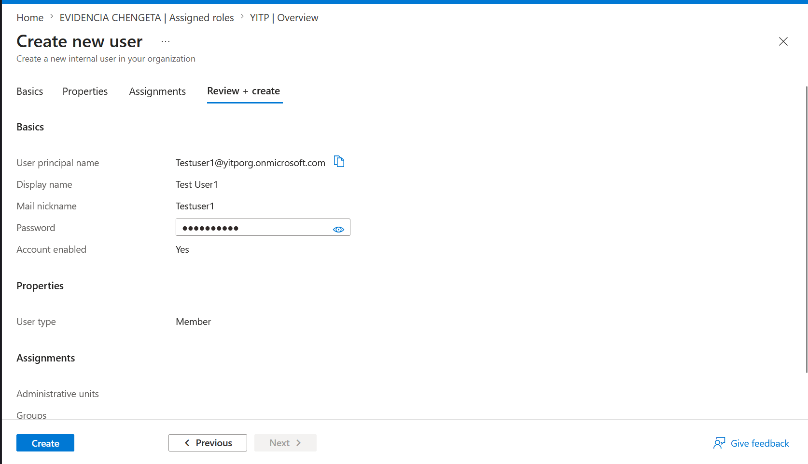

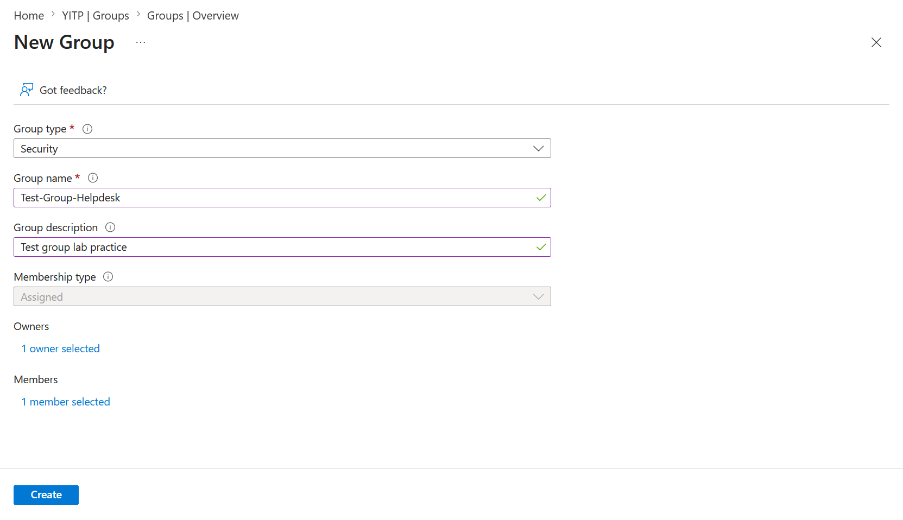

---

## Preparing the Domain Controller for Cloud Connectivity

Before installing any sync tool, the Domain Controller needed confirmed internet access and working DNS resolution — both required for it to reach Microsoft's cloud services.

1. Confirmed the DC's network adapter was set to **NAT Network** (allows outbound internet access while keeping the DC and client VM able to communicate with each other).
2. Tested raw connectivity: `ping 8.8.8.8` — successful, confirming outbound internet access works.
3. Tested DNS resolution: `nslookup microsoft.com` — successful, confirming domain name resolution works.

---

## Installing Microsoft Entra Connect

1. Downloaded Microsoft Entra Connect directly from the Entra admin center (**Identity → Hybrid Management → Microsoft Entra Connect → Get Started → Download Connect Sync Agent**) — Microsoft has retired the old public Download Center link for this tool.
2. Ran the installer inside the Domain Controller VM.

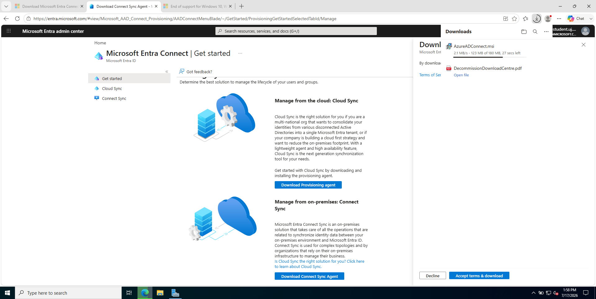

---

## Configuring the Sync (Custom Install)

Chose **Customize** instead of Express Settings, to understand and control each configuration decision rather than accept bundled defaults.

**User Sign-In method: Password Hash Synchronization**
Local AD password hashes are securely copied to the cloud, so sign-in checks happen against Entra ID directly. Chosen because it still works even if the Domain Controller is offline — unlike Pass-through Authentication, which requires the DC to be online for every login.

**Connect Directories**
Connected the local `corp.womenincyber.org` forest. Microsoft **does not allow** using a Domain/Enterprise Admin account directly for this — instead, Entra Connect automatically created a dedicated, least-privilege service account for the sync process itself.

**Domain/OU Filtering**
Chose **"Sync selected domains and OUs"** rather than syncing everything, to demonstrate deliberate scoping:

- **Included:** Students, Staff, Groups (the OUs representing regular end-users who would need cloud access in a real organization)
- **Excluded:** Admin-Accounts (Tier0/Tier1/Tier2) — privileged accounts were deliberately kept out of cloud sync, following least-privilege principles. Domain Admin credentials should not be exposed to the cloud identity plane.

**Optional Features**
Left all optional features (Password Writeback, Group Writeback, Device Writeback) unchecked — none were necessary to demonstrate the core hybrid sync mechanism.

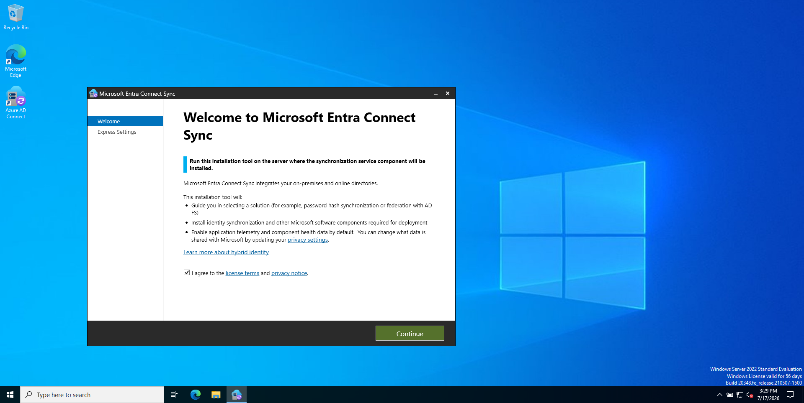
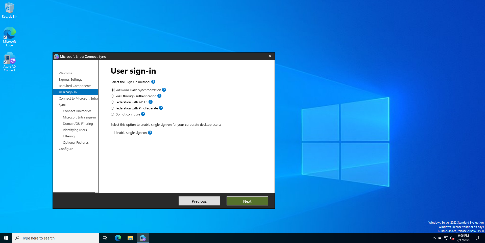
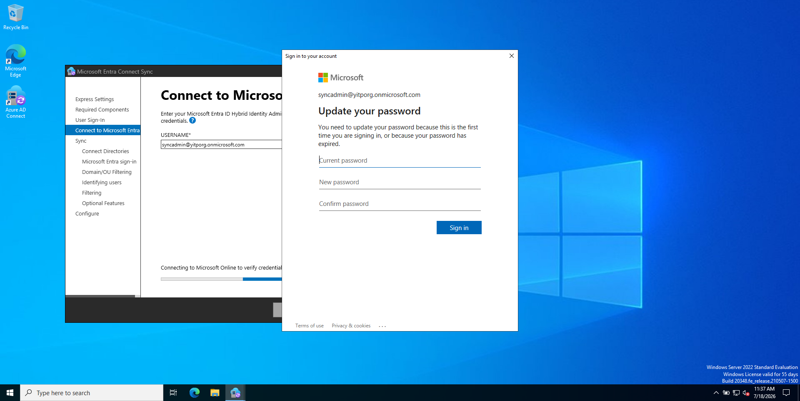
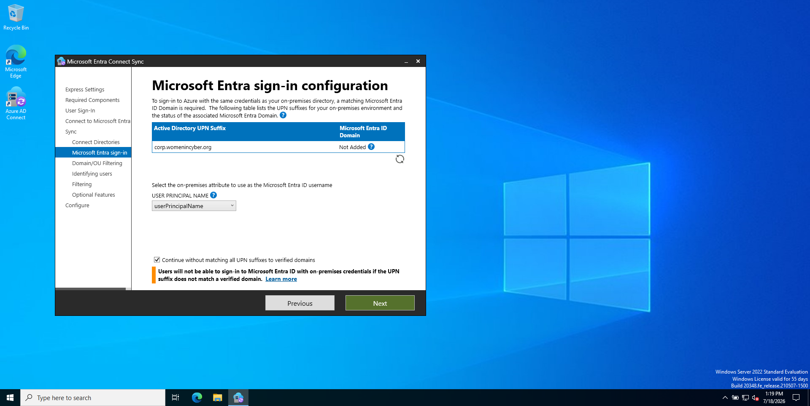

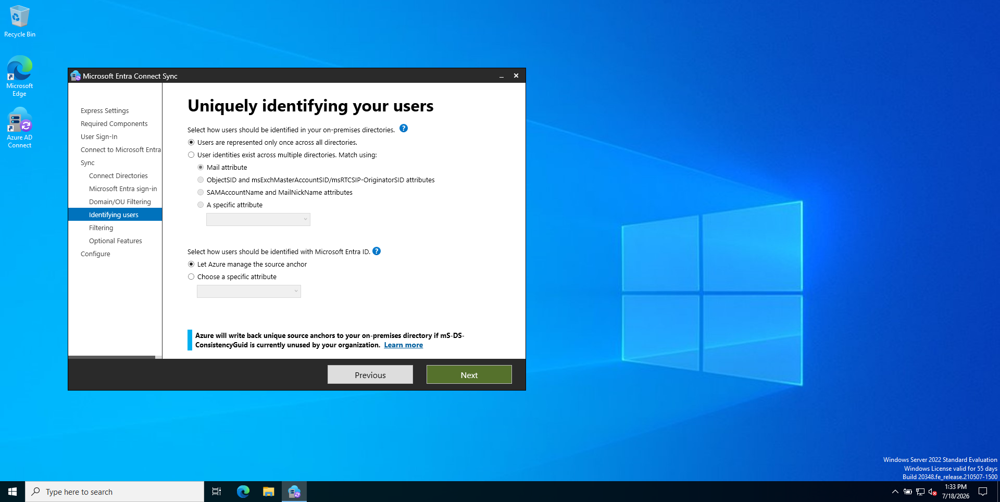
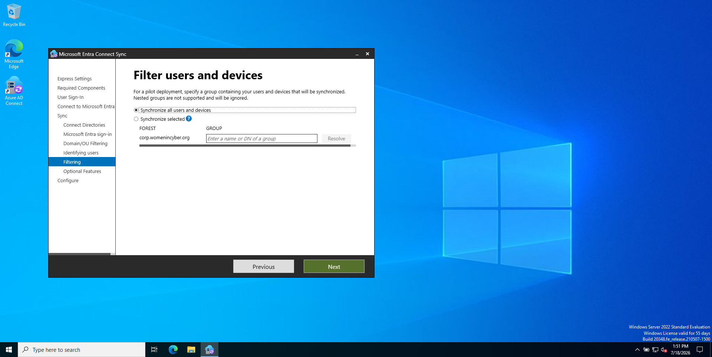
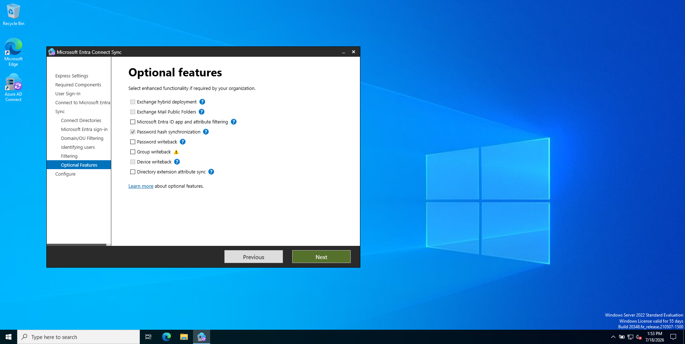
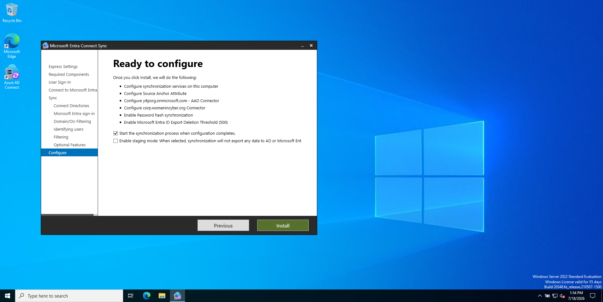
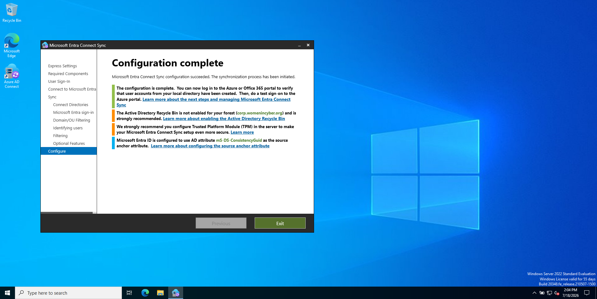
---

## Result — Sync Confirmed Working

After configuration completed, the Entra ID Users list showed real local Active Directory users now present in the cloud tenant, each correctly flagged **On-premises: Yes** — a direct contrast to the earlier manual test user, which correctly still showed **On-premises: No**.

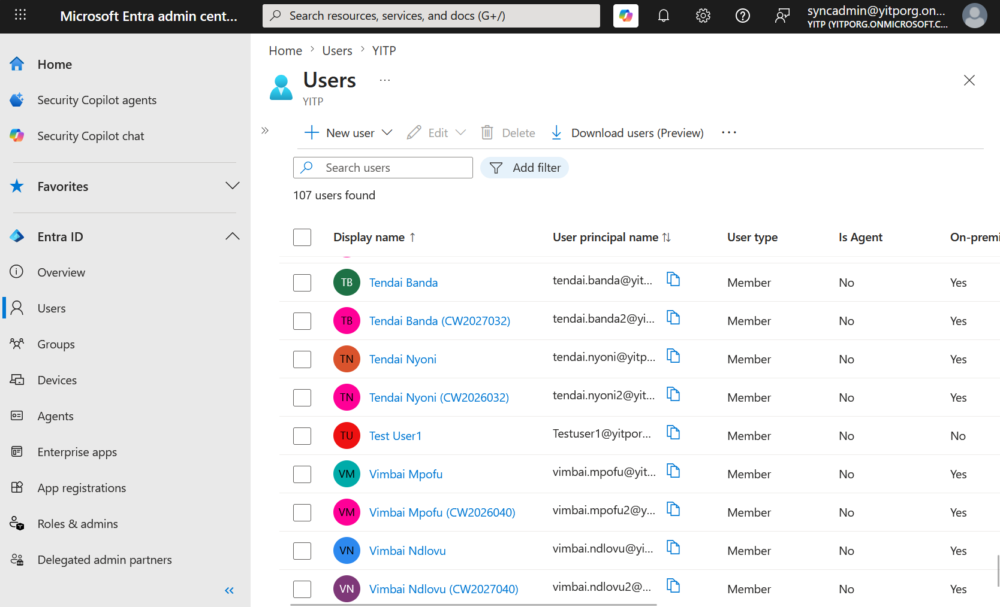

---

## Troubleshooting Notes

**Access Denied — missing Hybrid Identity Administrator role**
Being Global Administrator alone was not sufficient to authorize the sync tool. The more specific **Hybrid Identity Administrator** role had to be explicitly assigned, in addition to Global Administrator.
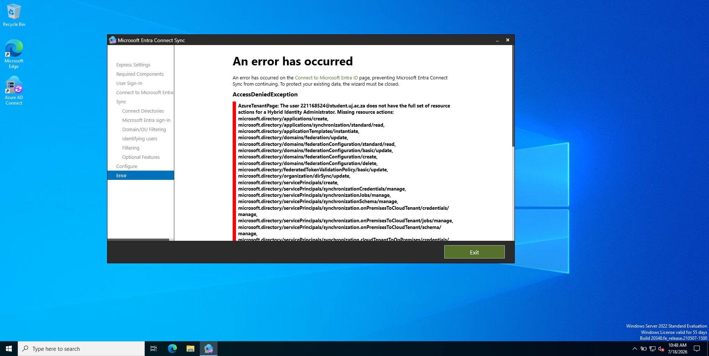
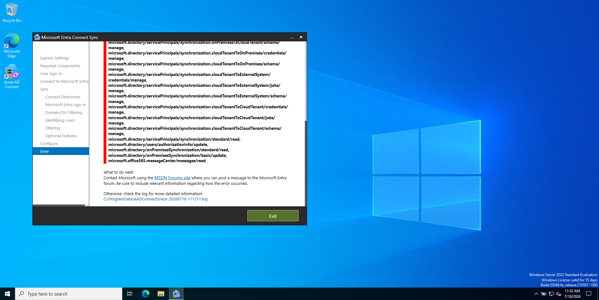

**Same error persisted after role assignment — Home Realm Discovery**
Signing in with a university email address caused Microsoft's login system to automatically route authentication back to the university's own tenant, rather than the intended tenant — even though the account held the correct roles in the intended tenant. Fixed by creating a **dedicated admin account native to the new tenant** (with no other organization's domain attached to it), removing any routing ambiguity.

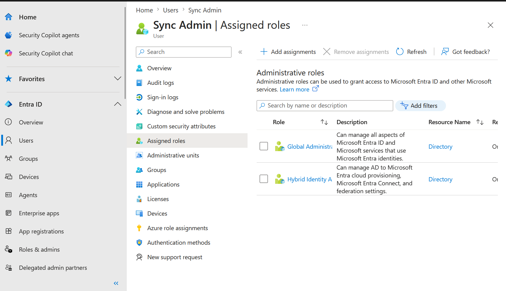

**Unsupported browser during account security setup**
The Domain Controller's built-in browser couldn't complete a new account's first-time security setup step. Resolved by completing that one-time setup from a modern browser on a separate device, after which the Domain Controller's sign-in completed normally.

**Sync Service not running**
Encountered after a VM restart — the background `ADSync` service hadn't started automatically. Resolved by starting it manually via `services.msc`.
